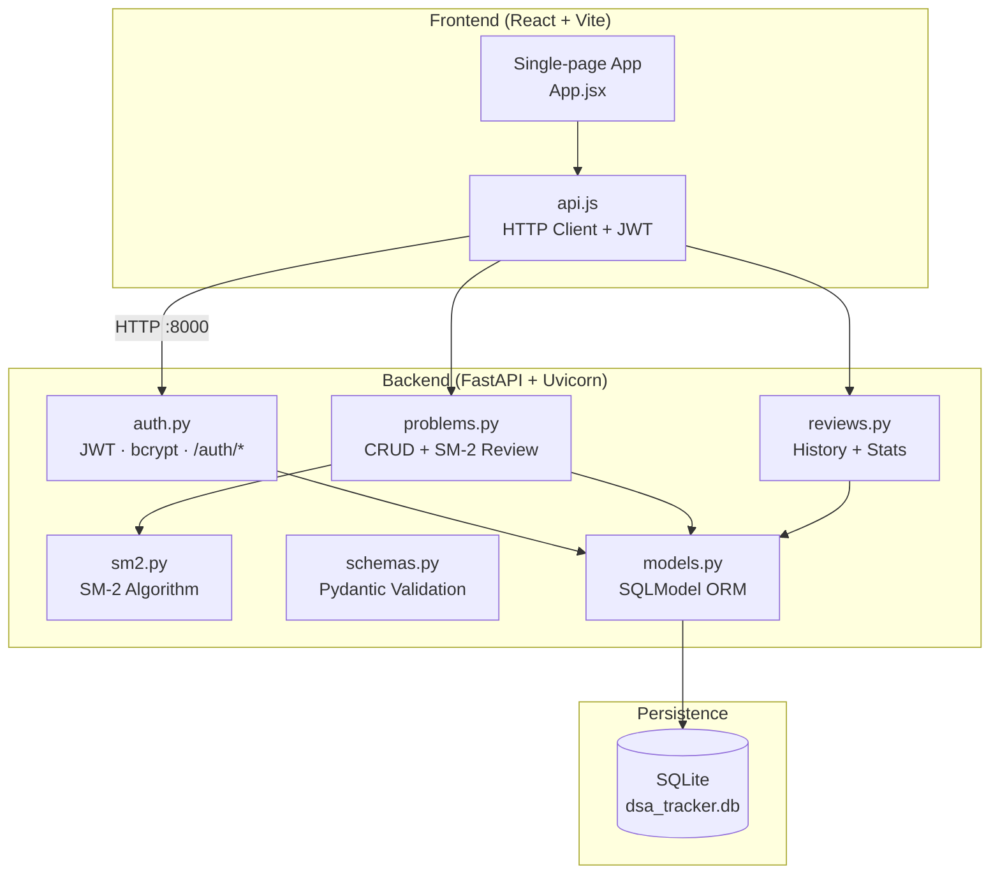
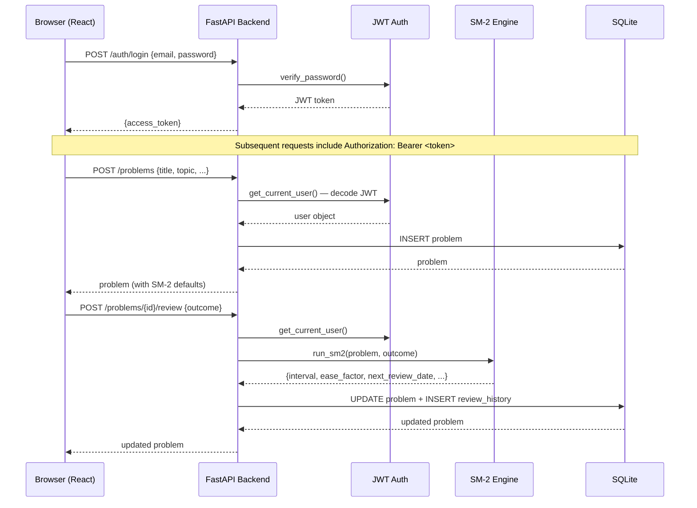
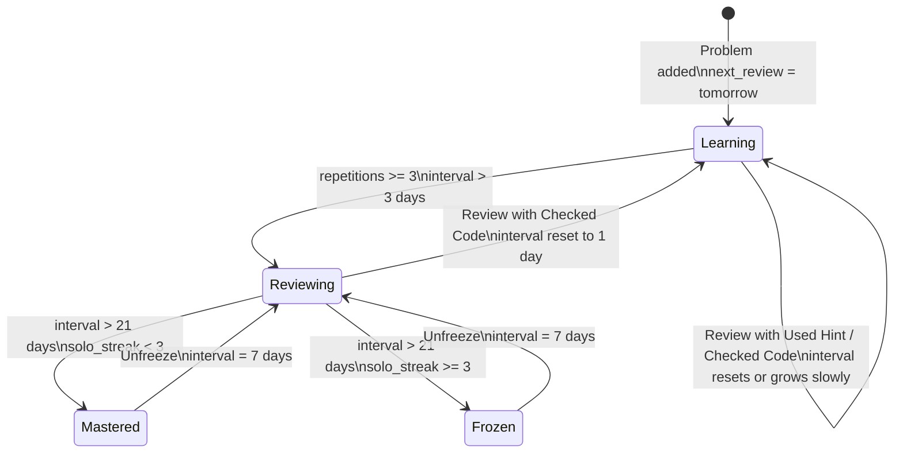
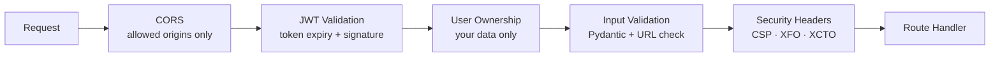

<div align="center">

# 🧠 Engram

**Spaced repetition DSA tracker for serious interview prep.**

Log problems, rate your confidence, and let SM-2 schedule exactly what to review each day — so nothing you've learned ever fades.

[](https://dsa-engram.netlify.app)
[](https://fastapi.tiangolo.com)
[](https://reactjs.org)
[](https://sqlite.org)
[](https://docker.com)

</div>

---

## What is Engram?

Most people grind LeetCode by solving as many problems as possible — and forget 80% of them within a week. Engram fixes that.

It applies the **SM-2 spaced repetition algorithm** (the same one behind Anki) to DSA problems. Every time you review a problem, you tell it how you solved it — and Engram schedules the next review at the exact moment before you'd forget it.

The result: fewer problems reviewed, deeper retention, better interviews.

---

## How it works

Add a problem → rate each attempt → SM-2 handles the rest.

| Outcome | What it means | Next review |
|---|---|---|
| ✅ Solved Solo | Figured it out completely | 3+ days, grows each time |
| 💡 Used Hint | Needed a nudge | 1 day |
| 👀 Checked Code | Had to look at the solution | 1 day, slower growth |

Problems move through four stages automatically:


[](https://dsa-engram.netlify.app)


```
🔴 Learning → 🟡 Reviewing → 🏆 Mastered → ❄️ Frozen
```

A problem **freezes** (leaves the review queue permanently) after you solve it solo 3 consecutive times with an interval over 21 days. You've truly mastered it. You can unfreeze any problem at any time to bring it back.

---

## Features

- **SM-2 Spaced Repetition** — server-side algorithm, not just a timer
- **Daily Dashboard** — see exactly what's due today, what's coming up, and your streak
- **Stage System** — Learning → Reviewing → Mastered → Frozen with automatic transitions
- **Problem Journal** — notes and key insight saved per problem
- **Stats Page** — 30-day activity heatmap, topic breakdown, outcome distribution
- **JWT Auth** — register, login, your data is yours alone
- **Cross-device sync** — data lives in the cloud, not your browser
- **Export to JSON** — back up your entire problem set anytime
- **Docker support** — one command local setup

---

## Table of Contents

- [1. Core Idea](#1-core-idea)
- [2. Technology Stack](#2-technology-stack)
- [3. System Architecture](#3-system-architecture)
- [4. Project Structure](#4-project-structure)
- [5. Key Features](#5-key-features)
- [6. SM-2 Algorithm](#6-sm-2-algorithm)
- [7. Spaced Repetition Flow](#7-spaced-repetition-flow)
- [8. API Overview](#8-api-overview)
- [9. Security Features](#9-security-features)
- [10. Setup Instructions](#10-setup-instructions)
- [11. Configuration](#11-configuration)
- [12. Running Both Servers](#12-running-both-servers)
- [13. Troubleshooting](#13-troubleshooting)

---

## 1. Core Idea

---

## 2. Technology Stack

### Backend

| Component | Technology |
|---|---|
| Framework | FastAPI (Python 3.11) |
| Database | SQLite via SQLModel / SQLAlchemy |
| Auth | JWT with bcrypt password hashing |
| Validation | Pydantic v2 |
| Server | Uvicorn |

### Frontend

| Component | Technology |
|---|---|
| UI Library | React 18 |
| Build Tool | Vite 5 |
| Styling | Tailwind CSS 3 |
| Charts | Recharts |
| Icons | Lucide React |

### Infrastructure

| Component | Technology |
|---|---|
| Containerization | Docker & Docker Compose |
| DB Volume | SQLite persisted via named volume |

---

## 3. System Architecture



**Request Flow:**



---

## 4. Project Structure

```text
dsa_tracker/
├── backend/
│   ├── routers/
│   │   ├── auth.py          # Register, login, me
│   │   ├── problems.py      # CRUD + review endpoint
│   │   └── reviews.py       # History & stats
│   ├── auth.py              # JWT, bcrypt, get_current_user
│   ├── sm2.py               # SM-2 spaced repetition algorithm
│   ├── models.py            # SQLModel tables (User, Problem, ReviewHistory)
│   ├── schemas.py           # Pydantic request/response models
│   ├── database.py          # SQLite engine & session
│   ├── main.py              # FastAPI app + CORS + security headers
│   ├── Dockerfile
│   ├── requirements.txt
│   ├── .env.example
│   └── .gitignore
├── frontend/
│   ├── src/
│   │   ├── App.jsx          # Single-file app (all views)
│   │   ├── api.js           # HTTP client with JWT + case conversion
│   │   ├── main.jsx         # ReactDOM entry point
│   │   └── styles.css       # Tailwind directives + animations
│   ├── index.html
│   ├── vite.config.js
│   ├── tailwind.config.js
│   ├── postcss.config.js
│   ├── package.json
│   └── .gitignore
├── docker-compose.yml
├── .gitignore
└── README.md
```

---

## 5. Key Features

- **SM-2 Spaced Repetition** — Server-side algorithm schedules review dates based on performance
- **JWT Authentication** — Register, login, and token-based session management
- **Dashboard** — Due today queue, coming up (7-day), mastered problems, 30-day activity graph
- **Problem Management** — Add, edit, delete problems with topic/difficulty/notes/key insight
- **Review Flow** — Three outcomes (Solved Solo / Used Hint / Checked Code) each affecting intervals differently
- **Stage Filtering** — Filter problems by stage: Learning, Reviewing, Mastered, Frozen
- **Stage Badges** — Visual indicators with emoji (🔄 Learning, 🔁 Reviewing, 🏆 Mastered, ❄️ Frozen)
- **Statistics** — Distribution pie chart, outcome breakdown, streak tracking
- **Unfreeze** — Frozen problems can be unfrozen to resume review
- **Password Visibility** — Eye/EyeOff toggle on password fields
- **Confirm Password** — Client-side match validation on registration
- **Security Headers** — CSP, X-Frame-Options, X-Content-Type-Options on all API responses
- **URL Validation** — Problem URLs restricted to http/https on both client and server
- **Dockerized** — One command to start both services

---

## 6. SM-2 Algorithm

The SM-2 algorithm (implemented in `backend/sm2.py`) determines the next review interval based on:

| Outcome | Quality | Effect on Interval | Effect on Streak |
|---|---|---|---|
| Solved Solo | 5 | Increases (or first-attempt override to 3d) | +1 |
| Used Hint | 3 | Increases slowly | Reset to 0 |
| Checked Code | 1 | Reset to 1 day | Reset to 0 |

**First-attempt overrides** (when `repetitions == 0`):
- Solved Solo → interval = 3 days
- Used Hint → interval = 1 day
- Checked Code → interval = 1 day

**Freeze condition**: `interval > 21 AND solo_streak >= 3` — problem is marked frozen and removed from review rotation.

---

## 7. Spaced Repetition Flow



---

## 8. API Overview

All endpoints serve JSON and require `Authorization: Bearer <token>` except `/auth/register` and `/auth/login`.

### Auth

| Method | Path | Description |
|---|---|---|
| POST | `/auth/register` | Create account (email, username, password) |
| POST | `/auth/login` | Login, returns JWT |
| GET | `/auth/me` | Current user info |

### Problems

| Method | Path | Description |
|---|---|---|
| GET | `/problems` | List all problems for current user |
| POST | `/problems` | Create a problem |
| GET | `/problems/{id}` | Get problem by ID |
| PUT | `/problems/{id}` | Update problem fields |
| DELETE | `/problems/{id}` | Delete problem |
| POST | `/problems/{id}/review` | Submit review outcome, runs SM-2 |

### Reviews

| Method | Path | Description |
|---|---|---|
| GET | `/reviews/history` | Review count per day (last 30 days) |
| GET | `/reviews/stats` | Aggregate stats (total, frozen, mastered, by topic, by outcome, streak) |

### System

| Method | Path | Description |
|---|---|---|
| GET | `/` | Health check |

---

## 9. Security Features



| Layer | Implementation |
|---|---|
| **CORS** | Restricted to `ALLOWED_ORIGINS` env var (default: `localhost:5173`) |
| **JWT** | 7-day expiry, signed with `SECRET_KEY`, validated on every protected route |
| **Password Hashing** | bcrypt via passlib |
| **Input Validation** | Pydantic schemas with length constraints, email format, URL protocol check |
| **User Isolation** | All queries scoped to `current_user.id` — users cannot access each others' data |
| **Security Headers** | `X-Content-Type-Options: nosniff`, `X-Frame-Options: DENY`, `Referrer-Policy`, `CSP` |
| **URL Sanitization** | Problem URLs must start with `http://` or `https://` (both client and server) |
| **Secret Key** | Required at startup — no fallback default |
| **Registration** | Generic error message prevents email enumeration |

---

## 10. Setup Instructions

### Prerequisites

- Docker & Docker Compose (recommended)
- OR Python 3.11+ and Node.js 18+ (manual)

### Quick Start (Docker)

```bash
# 1. Configure environment
cp backend/.env.example backend/.env
# Edit backend/.env and set a strong SECRET_KEY

# 2. Start both services
docker compose up -d

# 3. Access the app
# Frontend: http://localhost:5173
# Backend API: http://localhost:8000
# API Docs: http://localhost:8000/docs
```

### Manual Setup — Backend

```bash
cd backend
python -m venv venv
# Windows: venv\Scripts\activate
# Mac/Linux: source venv/bin/activate

pip install -r requirements.txt

# Configure .env
cp .env.example .env

# Start server
uvicorn main:app --reload --host 0.0.0.0 --port 8000
```

### Manual Setup — Frontend

```bash
cd frontend
npm install
npm run dev
```

---

## 11. Configuration

### Backend (`backend/.env`)

```env
# Required — generate with: python -c "import secrets; print(secrets.token_hex(32))"
SECRET_KEY=your-strong-random-key-here

# Optional — comma-separated allowed origins for CORS
ALLOWED_ORIGINS=http://localhost:5173

# Optional — defaults to sqlite:///./dsa_tracker.db
DATABASE_URL=sqlite:///./dsa_tracker.db
```

### Frontend (`frontend/.env`)

```env
VITE_API_URL=http://localhost:8000
```

---

## 12. Running Both Servers

### Docker (recommended)

```bash
docker compose up -d

# View logs
docker compose logs -f

# Stop
docker compose down

# Rebuild after code changes
docker compose up -d --build
```

### Separate Terminals

**Terminal 1 (Backend):**
```bash
cd backend
uvicorn main:app --reload --host 0.0.0.0 --port 8000
```

**Terminal 2 (Frontend):**
```bash
cd frontend
npm run dev
```

---

## 13. Troubleshooting

### Backend fails to start with "SECRET_KEY environment variable is required"

```bash
# Copy the example env and set a real key
cp backend/.env.example backend/.env
# Edit backend/.env and replace the placeholder
```

### Port already in use

```bash
# Windows
netstat -ano | findstr :8000
taskkill /PID <PID> /F

# Mac/Linux
lsof -i :8000
kill -9 <PID>
```

### Frontend can't reach backend

- Ensure backend is running on port 8000
- Check `VITE_API_URL` in `frontend/.env` matches the backend URL
- In Docker, both services must be on the same network (handled by `docker-compose.yml`)

### Docker rebuild not picking up changes

```bash
docker compose up -d --build
```

### Database reset

```bash
# Delete the SQLite database and restart
docker compose down
docker volume rm dsa_tracker_sqlite_data
docker compose up -d
```

---

For issues and questions:
- Review the troubleshooting section above
- Check API documentation at http://localhost:8000/docs
- Inspect the browser console for frontend errors
- Review terminal output for backend errors
